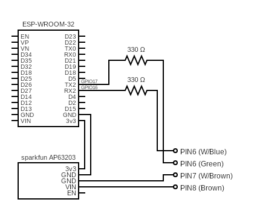

# SpaNet MQTT ESP32 bridge

SpaNet serial to mqtt bridge, including HomeAssitant autodiscovery.

Developed for the ESP32 Dev board but should work on any ESP32 platform. By default uses UART2 for communications with the SpaNet controller.

Discussion on this (and other) SpaNet projects can be found here https://discord.com/channels/967940763595980900/967940763595980903

## Configuration
On first boot or whenever the enable key is press the board will enter hotspot mode.  Connect to the hotspot to configure wifi & mqtt settings.  

## Firmware updates

Firmware updates can be pushed to http://<ipaddress>/fota

## Logging

Debug / log functionality is available by telneting to the device's ip address

## Circuit
To keep things as simple as possible, off the shelf modules have been used.  
NOTE: The resitors on the RX/TX pins are recommended but optional.  

  

